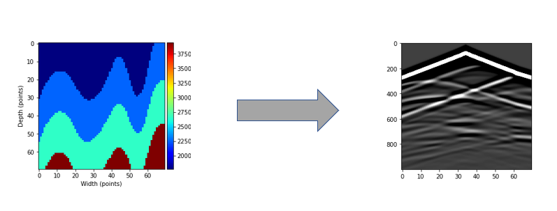
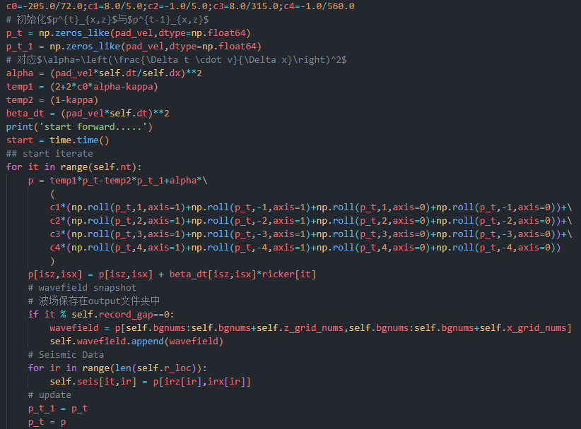

# Acoustic Forward Operator

> Latex公式不渲染，可以看[README.pdf](./README.pdf)版本

## 理论

### 一般形式

对于声波正演问题，即从已知的速度图出发通过求解声波方程得到地震图，如下图所示：



声波方程的一般表达式如下：
$$
\nabla^2 p(x,z,t)-\frac{1}{v(x,z)^2}\frac{\partial^2p(x,z,t)}{\partial t^2}=s(x,z,t)\tag{1}
$$
其中：

- $p(x,z,t)$表示波场，即波在空间中任意时刻$t$及任意位置$(x,z)$处的能量值
- $v(x,z)$表示速度场，即空间中任意位置的速度大小，对应输入的速度图
- $s(x,z,t)$表示在$(x,z)$处的源在$t$时刻发出的能量（对于没有源的位置，值为0）

求解该方程，即可得到空间中任意时刻的波场$p$并根据$p$得到地震图（所谓地震图就是在接收器的位置上，t时刻接收到的波的能量值大小）

### 2-8阶中心有限差分

可以利用中心有限差分法对上述声波方程进行数值求解，在本项目中，对时域进行2阶差分，对空间域进行8阶差分。即：

In time domain:
$$
\frac{\partial^2 p(x,z,t)}{\partial t^2} = \frac{1}{(\Delta t)^2}\left(p^{t+1}_{x,z}-2p^{t}_{x,z}+p^{t-1}_{x,z}\right)\tag{2}
$$
In space domain:

$$
\begin{aligned}
\nabla^2 p(x,z,t) 
&= \frac{\partial^2 p(x,z,t)}{\partial x^2}+\frac{\partial^2 p(x,z,t)}{\partial z^2}\\
&= \frac{1}{(\Delta x)^2}\sum_{i=-4}^{4}{c_i p_{x+i,z}^t}+\frac{1}{(\Delta z)^2}\sum_{i=-4}^{4}{c_i p_{x,z+i}^t}
\end{aligned}\tag{3}
$$
where $c_0=-\frac{205}{72},c_1=\frac{8}{5},c_2=-\frac{1}{5},c_3=\frac{8}{315},c_4=-\frac{1}{560}$

为了简化运算，我们设置$\Delta x=\Delta z$

将$(2),(3)$式带入$(1)$式中得到：
$$
\frac{1}{(\Delta x)^2}\sum_{i=-4}^{4}{c_i p_{x+i,z}^t}+\frac{1}{(\Delta z)^2}\sum_{i=-4}^{4}{c_i p_{x,z+i}^t}-\frac{1}{v_{x,z}^2}\frac{1}{(\Delta t)^2}\left(p^{t+1}_{x,z}-2p^{t}_{x,z}+p^{t-1}_{x,z}\right)=s_{x,z}^t\tag{4}\\
$$

$$
\Rightarrow\\
$$


$$
p^{t+1}_{x,z} =(2+2c_0\alpha)p_{x,z}^t-p_{x,z}^{t-1}+\alpha\sum_{i=-4,i\neq0}^{i=4}c_i\left(p_{x+i,z}^t+p_{x,z+i}^t\right)-(\Delta tv_{x,z})^2s_{x,z}^t\tag{5}
$$

#### 边界条件

为了防止边界反射问题，采用吸收边界条件，即在空间四周扩充边界，边界上的衰减方程为：
$$
\kappa = \frac{3u^2v\Delta t}{2L^3}\log(\frac{1}{R})
$$
其中$L$是拓展边界的长度(m),$u$是拓展边界上的点到边界的距离，$v$取速度图中的最小速度，$R=10^{-7}$

因此添加边界条件后的最终迭代式如下：
$$
p^{t+1}_{x,z} =(2+2c_0\alpha-\kappa)p_{x,z}^t-(1-\kappa)p_{x,z}^{t-1}+\alpha\sum_{i=-4,i\neq0}^{i=4}c_i\left(p_{x+i,z}^t+p_{x,z+i}^t\right)-(\Delta tv_{x,z})^2s_{x,z}^t\tag{6}
$$

## 代码结构

定义了Wave_Forward类

### 类参数

```python
class Wave_Forward:
    def __init__(self,
                 velocity_model,
                 x_grid_nums,
                 z_grid_nums,
                 dx,
                 bgnums,
                 nt,
                 dt,
                 freq,
                 s_loc,
                 r_loc,
                 record_gap=20,
                 save_seis='seismic.npy',
                 save_wavefield='wavefield.npy'
                 )
```

其中类输入参数的解析如下：

- velocity_model:速度图模型，array-like 大小应该与网格数x_grid_nums,z_grid_nums相同
- x_grid_nums:划分的x轴网格数，int 应该与速度图大小对应
- z_grid_nums:划分的z轴网格数，int 应该与速度图大小对应
- dx:网格间距，float, 单位(m)
- bgnums:拓展边界的网格数，int
- nt:总的迭代时间步
- dt:每个时间步的时间间隔
- freq:ricker子波的中心频率（振幅默认是1）
- s_loc:炮的位置（现在只支持单炮）tuple, (x,z)
- r_loc:接收器的位置 list,[(x_1,z_1)(x_2,z_2)...(x_n,z_n)]
- save_seis:保存生成的地震图的文件名
- save_wavefield:保存生成的波长图的文件名

### 类方法

#### forward(self)

```python
def forward(self):
    '''
    正演函数
    return: 
        seis: 地震波图 array-like (nt,len(r_loc))
        wavefield:  波场快照
    '''
```

正演函数，能够返回波场图以及地震图

正演的关键是对公式进行迭代（即公式$(6)$），在该函数中的语句如下：



#### ABC_coef(self,pad_vel)

```python
def ABC_coef(self,pad_vel):
    '''
    吸收边界条件
    params:
        pad_vel:扩展后的速度图(利用pad_velocity函数产生)
    return:
        damp: 吸收边界  array-like  damp.shape=pad_vel.shape
              在吸收边界上值离边界距离递增,在其他区域值为0
    '''
```

该方法能够返回一个与扩展边界后的速度图相同大小的数组`damp`该数组在原来速度图的位置值为0，在扩展的边界上的值由衰减函数$\kappa$决定

#### pad_velocity(self)

```python
def pad_velocity(self):
    '''
    扩展速度图边界
    return:
        pad_vel 扩展边界后的速度图

    example:
        vel = [[1,2,3],
               [4,5,6],
               [7,8,9]]
        bgnums = 2

        ==>

        pad_vel = [[1, 1, 1, 2, 3, 3, 3],
                   [1, 1, 1, 2, 3, 3, 3],
                   [1, 1, 1, 2, 3, 3, 3],
                   [4, 4, 4, 5, 6, 6, 6],
                   [7, 7, 7, 8, 9, 9, 9],
                   [7, 7, 7, 8, 9, 9, 9],
                   [7, 7, 7, 8, 9, 9, 9]]
    '''
```

返回扩展边界后的速度图，如注释例子所示

#### ricker_wavelet(self)

```python
def ricker_wavelet(self):
    '''
    产生ricker子波

    params:   
            freq:ricker子波的中心频率
            dt  :采样时间间隔 1/freq >> 2*dt(避免假频)
    '''
```

该函数会产生一个完整的ricker子波波段，若产生的步数不足`nt`，则用0进行填充，这里需要注意采样时间间隔 1/freq >> 2dt，以避免假频现象

#### _adjust_loc(self)

```python
def _adjust_loc(self):
    '''
    由于添加了吸收边界层，接收器与炮的绝对位置发生了变化
    return:
        isx:    炮在扩充边界后的x轴索引位置
        isz:    炮在扩充边界后的z轴索引位置
        irx:    接收器在扩充边界后的x轴索引位置
        irz:    接收器在扩充边界后的z轴索引位置
    '''
```

该函数修正了扩充边界后，炮与接收器的绝对位置改变问题。


